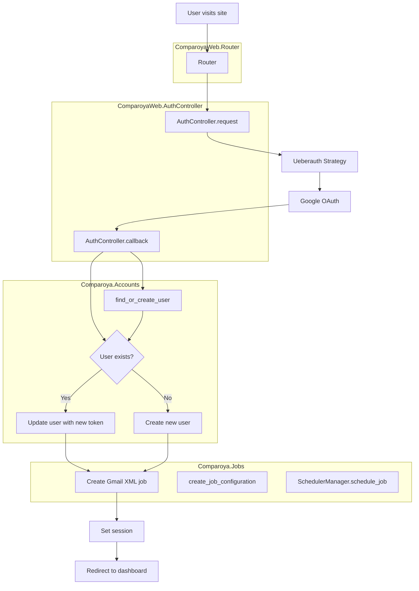
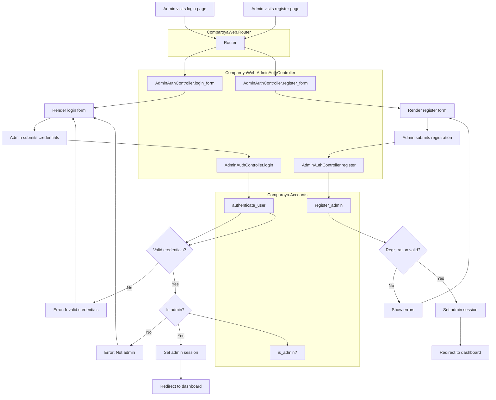
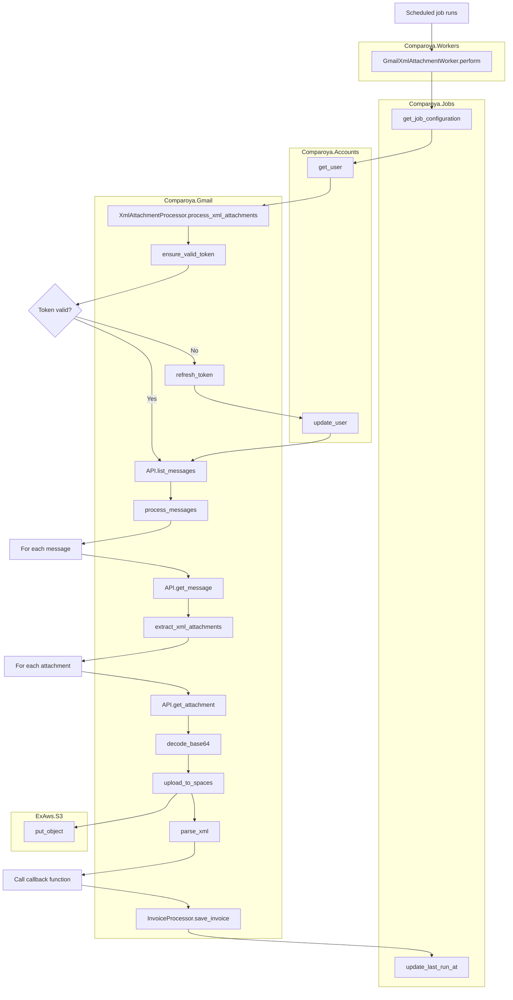
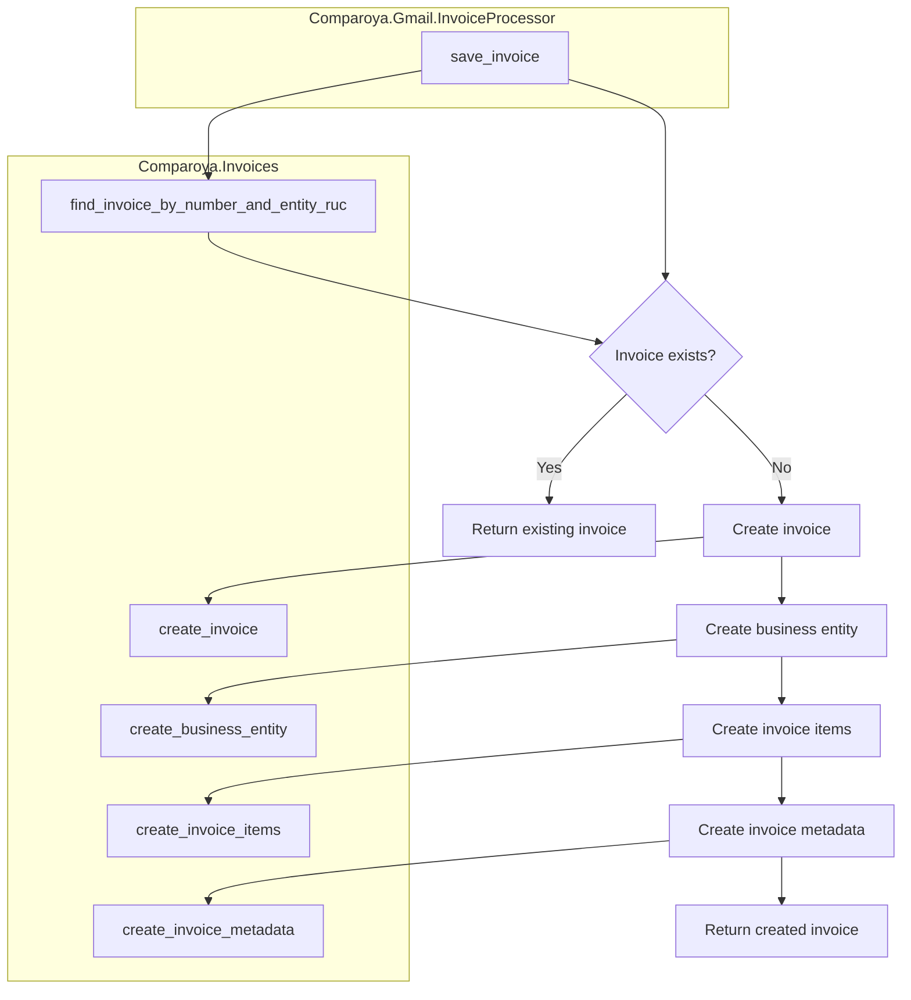
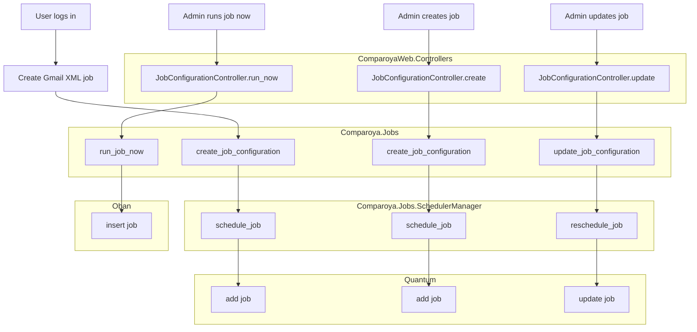

# Comparoya Application Flow Diagrams

This document contains flow diagrams for all major operations in the Comparoya application, showing the modules and functions involved in each process.

## 1. User Authentication Flow (OAuth with Google)



## 2. Admin Authentication Flow



## 3. Gmail XML Attachment Processing Flow



## 4. Invoice Processing Flow



## 5. Job Configuration and Scheduling Flow



## 6. System Architecture Overview

```mermaid
flowchart TD
    A[User Browser] <--> B[Phoenix Endpoint]
    B <--> C[Router]
    C <--> D[Controllers]
    D <--> E[Plugs]
    D <--> F[Business Logic]
    F <--> G[Database]
    F <--> H[External Services]
    
    I[Scheduled Jobs] --> J[Oban Workers]
    J --> F
    
    subgraph "ComparoyaWeb"
        B[Endpoint]
        C[Router]
        D[Controllers]
        E[Plugs]
    end
    
    subgraph "Comparoya"
        F[Business Logic]
        I[Scheduler]
        J[Workers]
    end
    
    subgraph "External"
        G[PostgreSQL]
        H[Gmail API, DigitalOcean Spaces]
    end
